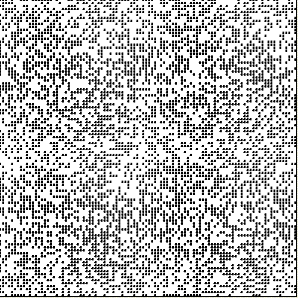

# *Hra života (Conway's Game of Life)*
Implementace Hry života v C++ pomocí knihovny [Raylib](https://www.raylib.com/)



## **O hře**
Hra života je dvoustavový, dvourozměrný celulární automat, který svým chováním připomíná vývoj společenství živých organismů. 
Odehrává se na matici čtvercových buněk. Každá z těchto buněk má dva stavy - živá či mrtvá. Buňka sousedí s 8 dalšími buňkami, 
se kterými se dotýká hranou (ortogonálně) či vrcholem (diagonálně). Hra se odehrává v diskrétním čase, uživatel pouze určí počateční stav
a poté hra běží automaticky podle jednoduchých pravidel.

### **Pravidla**    
Stav buněk v další generaci závisí na následujících pravidlech:
1. Každá živá buňka s méně než dvěma živými sousedy zemře.
2. Každá živá buňka s více než třemi živými sousedy zemře.
3. Každá živá buňka se dvěma nebo třemi živými sousedy zůstává žít.
4. Každá mrtvá buňka s právě třemi živými sousedy oživne.

## **Spuštění hry**

### **Instalace Raylib**
Pro spuštění je potřeba nejprve nainstalovat knihovnu Raylib. Níže je popsán postup instalace na Linux Ubuntu. Instalace pro jiné systémy jsou popsány [zde](https://github.com/raysan5/raylib).

1. Je potřeba **GCC** (překladač), **make** a **git** 
```
sudo apt install build-essential git
```

2. Instalace potřebných knihoven pro Raylib
```
sudo apt install libasound2-dev libx11-dev libxrandr-dev libxi-dev libgl1-mesa-dev libglu1-mesa-dev libxcursor-dev libxinerama-dev libwayland-dev libxkbcommon-dev
```

3. Stažení knihovny Raylib z github repozitáře
```
git clone --depth 1 https://github.com/raysan5/raylib.git raylib
```

4. Kompilace knihovny
```
cd raylib/src/
```
```
make PLATFORM=PLATFORM_DESKTOP # To make the static version.
```
```
sudo make install # Static version.
```

### Instalace Hry života

1. Stažení tohoto repozitáře z githubu pomocí **SSH**, **HTTPS** nebo **GitHub CLI**

2. Přeložení kódu pomocí
```
bash build.bash
```

3. Spuštění binárního souboru 
```
./build/GameOfLife 
```

4. Ukončení hry pomocí *esc* nebo *tlačítka pro ukončení programu*